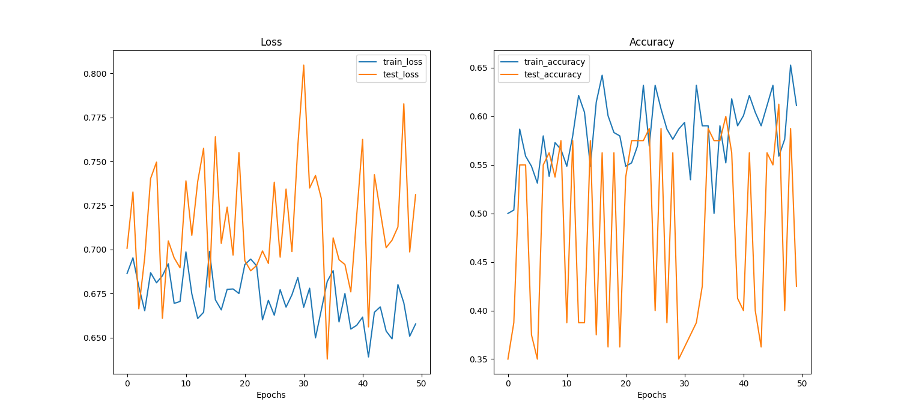

This repo contains the code for the model for the video modality of my MLPR (Machine Learning & Pattern Recognition) project.

Working with Hibah Ihsan and Chaitanya Modi on this.

Sample plot of our model. (Still working on this)

